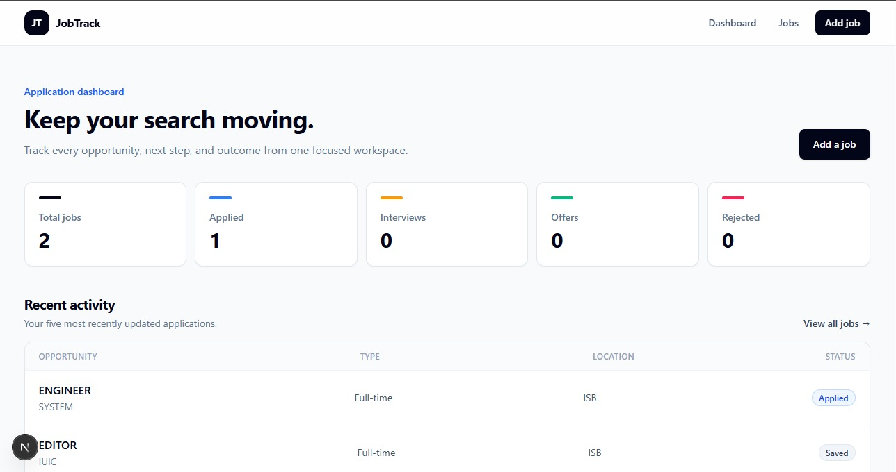
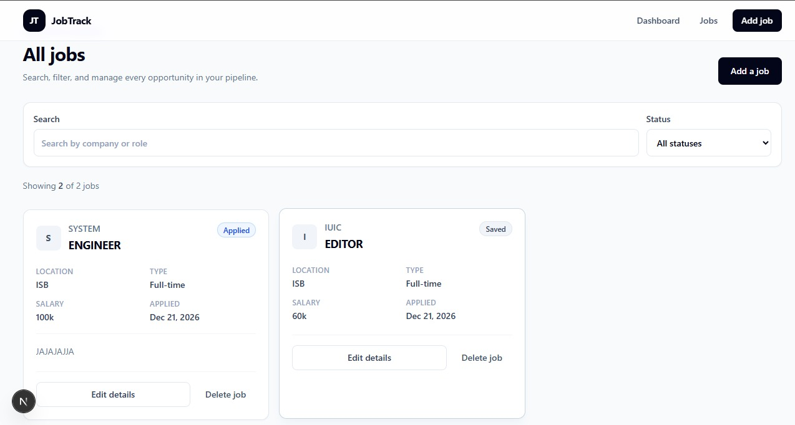
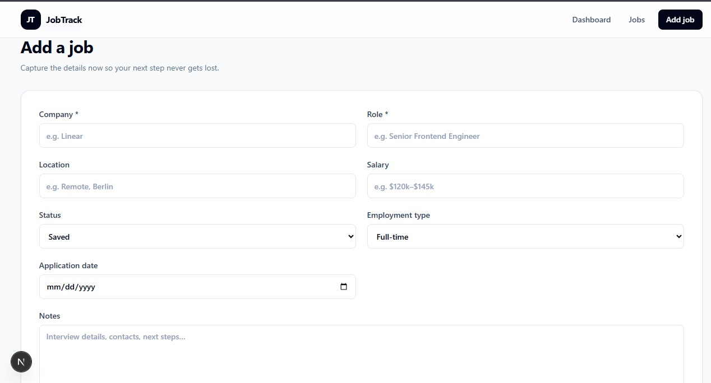
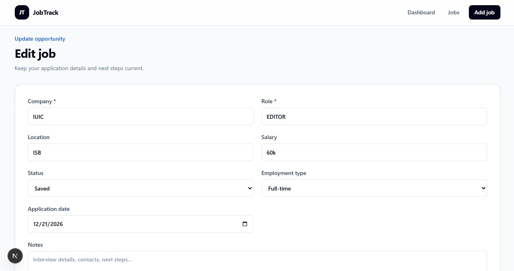

# JobTrack

A focused, full-stack application for tracking job opportunities from the first save through a final outcome.

JobTrack keeps the core job-search workflow in one place: record an opportunity, update its status, search the pipeline, and review progress from a compact dashboard. The project is intentionally single-user and dependency-light so the codebase stays easy to understand, run, and extend.

## What it does

- Tracks saved, applied, interview, offer, and rejected opportunities
- Creates, reads, updates, and deletes job records through typed API routes
- Searches jobs by company or role and filters them by status
- Summarizes total jobs and key pipeline stages on the dashboard
- Stores optional location, salary, employment type, application date, and notes
- Validates required company and role fields in both the form and API
- Handles empty results, missing records, loading states, and request failures
- Adapts the dashboard, filters, cards, and forms for mobile screens

## Technical highlights

- Next.js App Router with server-rendered data views
- Client components limited to forms, filtering, and delete interactions
- Prisma schema with enums, timestamps, and indexes for common queries
- Reused Prisma Client instance during development hot reloads
- Shared TypeScript types and validation utilities across UI and API layers
- REST-style route handlers with consistent JSON errors and HTTP status codes
- Reusable UI primitives built with Tailwind CSS and no component library
- Strict ESLint configuration with warnings treated as failures

## Tech stack

| Area | Technology |
| --- | --- |
| Framework | Next.js 16 App Router |
| Language | TypeScript 5 |
| Interface | React 19, Tailwind CSS 4 |
| Database | Neon PostgreSQL |
| Data access | Prisma ORM 6 |
| Code quality | ESLint, Next.js Core Web Vitals rules |

## Screenshots

### Dashboard



### Jobs list



### Add a job



### Edit a job



## Project structure

```text
job-tracker-app/
|-- prisma/
|   |-- migrations/              # Versioned database changes
|   `-- schema.prisma            # Job model and enums
|-- src/
|   |-- app/
|   |   |-- api/jobs/
|   |   |   |-- [id]/route.ts    # Read, update, and delete one job
|   |   |   `-- route.ts         # List and create jobs
|   |   |-- jobs/
|   |   |   |-- [id]/edit/       # Edit page
|   |   |   |-- new/             # Create page
|   |   |   `-- page.tsx         # Searchable job pipeline
|   |   `-- page.tsx             # Dashboard
|   |-- components/
|   |   |-- jobs/                # Job-specific interface components
|   |   |-- layout/              # Navigation and page container
|   |   `-- ui/                  # Button, input, select, and badge
|   |-- lib/                     # Prisma client and job utilities
|   `-- types/                   # Shared application types
|-- .env.example
`-- package.json
```

## Run locally

### Prerequisites

- Node.js 20.9 or newer
- npm 10 or newer
- A PostgreSQL database, either a Neon development branch or a local PostgreSQL instance

### Setup

```bash
git clone <your-repository-url>
cd job-tracker-app
npm install
cp .env.example .env
npm run db:deploy
npm run dev
```

Replace the placeholder `DATABASE_URL` in `.env` before running the database command. For the simplest setup, create a Neon project and use its pooled connection string. The hostname of a pooled Neon URL includes `-pooler`.

On Windows PowerShell, replace the copy command with:

```powershell
Copy-Item .env.example .env
```

Open [http://localhost:3000](http://localhost:3000).

## Windows setup note

Node.js is required before any project command will work. Install the current Node.js LTS release, restart PowerShell, and confirm both commands are available:

```powershell
node -v
npm -v
```

Then install dependencies and start the application:

```powershell
npm install
Copy-Item .env.example .env
npm run db:deploy
npm run dev
```

Edit `.env` and replace the placeholder connection string before running `npm run db:deploy`. If PowerShell reports that `node` or `npm` is not recognized, install Node.js LTS and restart PowerShell so the updated system `PATH` is loaded.

## Environment variables

| Variable | Required | Local value | Purpose |
| --- | --- | --- | --- |
| `DATABASE_URL` | Yes | Neon pooled PostgreSQL URL | Used by Prisma Client and Prisma Migrate |

Copy the pooled connection string from the Neon Console. It should start with `postgresql://`, use a hostname containing `-pooler`, and include `sslmode=require`. Keep the real value in `.env` locally and in Vercel environment variables for deployment. Never commit database credentials.

## Scripts

| Command | Purpose |
| --- | --- |
| `npm run dev` | Start the development server |
| `npm run build` | Create a production build |
| `npm run postinstall` | Regenerate Prisma Client after dependency installation |
| `npm run start` | Serve the production build |
| `npm run lint` | Run ESLint with zero warnings allowed |
| `npm run db:migrate` | Create or apply a development migration |
| `npm run db:deploy` | Apply committed migrations to a production database |
| `npm run db:generate` | Regenerate Prisma Client |
| `npm run db:studio` | Inspect local records in Prisma Studio |

## API routes

| Method | Route | Description |
| --- | --- | --- |
| `GET` | `/api/jobs` | List jobs; supports optional `query` and `status` parameters |
| `POST` | `/api/jobs` | Create a job |
| `GET` | `/api/jobs/:id` | Get one job |
| `PATCH` / `PUT` | `/api/jobs/:id` | Update one job |
| `DELETE` | `/api/jobs/:id` | Delete one job |

## Deployment notes

### 1. Create the Neon database

1. Sign in to the [Neon Console](https://console.neon.tech/) and create a project.
2. Choose a project name and a region close to the Vercel deployment region.
3. Open the project dashboard and select **Connect**.
4. Select the branch, database, and role to use.
5. Enable the pooled connection option and copy the connection string. The hostname should contain `-pooler`.

### 2. Apply the Prisma migration

Set the Neon connection string as `DATABASE_URL` in your local `.env`, then run:

```bash
npm install
npm run db:deploy
```

`db:deploy` runs `prisma migrate deploy`, which applies the committed PostgreSQL migration without creating a new migration. Do not use `prisma migrate dev` against the production database.

### 3. Import the GitHub repository into Vercel

1. Sign in to [Vercel](https://vercel.com/) and select **Add New → Project**.
2. Import the GitHub repository.
3. Confirm the **Next.js** framework preset. If the application is inside a larger repository, set the root directory to `job-tracker-app`; otherwise leave the repository root unchanged.
4. Before the first deployment, expand **Environment Variables** and add `DATABASE_URL` with the pooled Neon connection string.
5. Enable the variable for **Production**. Only enable it for **Preview** or **Development** if those deployments should intentionally use that database; a separate Neon branch is safer for preview deployments.
6. Select **Deploy**. Vercel will install dependencies and run `npm run build` automatically.

After changing an environment variable, redeploy so the new value is available to the application. Future pushes to the production branch trigger new Vercel deployments.

### Future schema changes

Create migrations against a development database:

```bash
npm run db:migrate -- --name describe_the_change
```

Commit the generated migration, apply it to Neon with `npm run db:deploy`, and then deploy the matching application code.

## Scope and limitations

- Version 1 is intentionally single-user and does not include authentication.
- Local development now requires access to PostgreSQL; SQLite is no longer configured.
- Search and status filtering run against the records already loaded by the jobs page.
- Automated tests are not included yet; linting, TypeScript checks, and the production build are the current verification steps.
- Existing data in the previous local SQLite file is not transferred automatically to Neon.

## Future improvements

- Add automated tests for validation and route handlers
- Add pagination for larger job lists
- Add CSV import and export
- Add separate Neon branches for automated preview deployments
